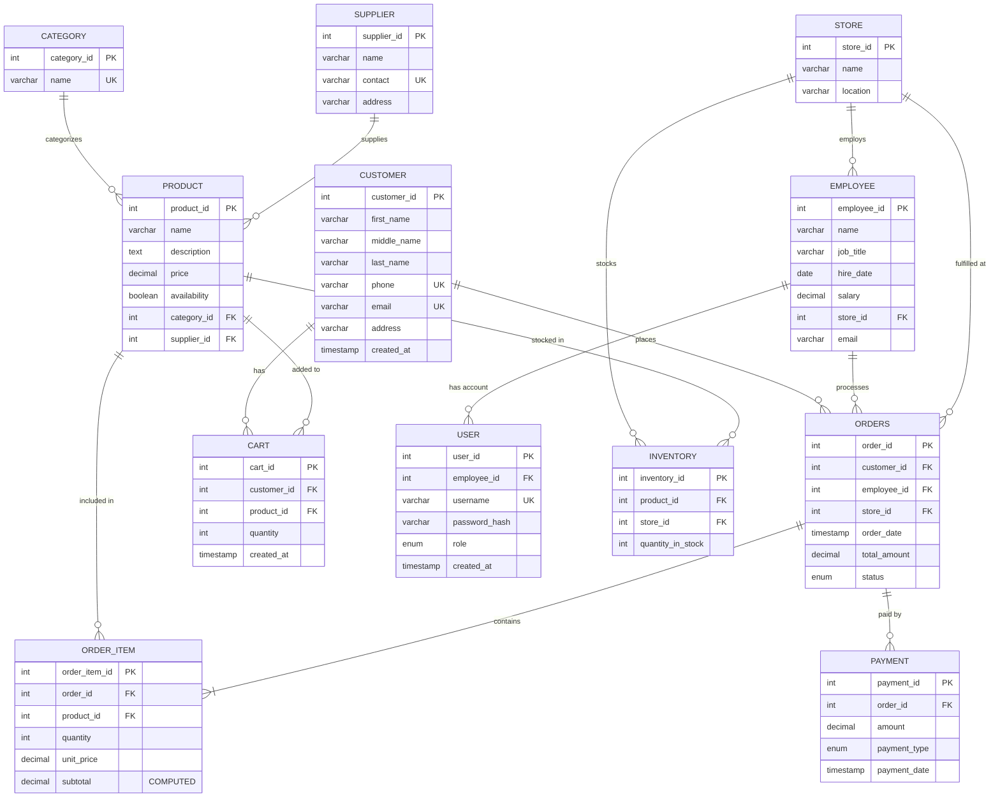

# Cash & Carry Mart - Database Schema Documentation

## Overview
This document describes the complete database schema for the Cash & Carry Mart Management System, including all tables, relationships, and constraints.

---

## Entity Relationship Diagram (ERD)



---

## Relational Schema Diagram

```
┌─────────────────────────────────────────────────────────────────────────────┐
│                         CASH & CARRY MART DATABASE                          │
└─────────────────────────────────────────────────────────────────────────────┘

┌──────────────────┐         ┌──────────────────┐         ┌──────────────────┐
│    CUSTOMER      │         │      STORE       │         │    CATEGORY      │
├──────────────────┤         ├──────────────────┤         ├──────────────────┤
│ PK customer_id   │         │ PK store_id      │         │ PK category_id   │
│    first_name    │         │    name          │         │    name (UK)     │
│    middle_name   │         │    location      │         └──────────────────┘
│    last_name     │         └──────────────────┘                 │
│    phone (UK)    │                 │                            │
│    email (UK)    │                 │                            │
│    address       │                 │                            ▼
│    created_at    │                 │                  ┌──────────────────┐
└──────────────────┘                 │                  │    SUPPLIER      │
        │                            │                  ├──────────────────┤
        │                            │                  │ PK supplier_id   │
        │                            ▼                  │    name          │
        │                  ┌──────────────────┐        │    contact (UK)  │
        │                  │    EMPLOYEE      │        │    address       │
        │                  ├──────────────────┤        └──────────────────┘
        │                  │ PK employee_id   │                 │
        │                  │    name          │                 │
        │                  │    job_title     │                 │
        │                  │    hire_date     │                 ▼
        │                  │    salary        │        ┌──────────────────┐
        │                  │ FK store_id      │        │     PRODUCT      │
        │                  │    email         │        ├──────────────────┤
        │                  └──────────────────┘        │ PK product_id    │
        │                          │                   │    name          │
        │                          │                   │    description   │
        │                          │                   │    price         │
        ├──────────────────────────┼───────────────────┤    availability  │
        │                          │                   │ FK category_id   │
        │                          │                   │ FK supplier_id   │
        │                          │                   └──────────────────┘
        │                          │                            │
        │                          │                            │
        ▼                          │                            │
┌──────────────────┐              │                            │
│      CART        │              │                            │
├──────────────────┤              │                            │
│ PK cart_id       │              │                            │
│ FK customer_id   │              │                            │
│ FK product_id    │◄─────────────┼────────────────────────────┘
│    quantity      │              │
│    created_at    │              │
└──────────────────┘              │
                                  │
        │                         │
        │                         │
        ▼                         ▼
┌──────────────────┐    ┌──────────────────┐
│     ORDERS       │    │    INVENTORY     │
├──────────────────┤    ├──────────────────┤
│ PK order_id      │    │ PK inventory_id  │
│ FK customer_id   │    │ FK product_id    │
│ FK employee_id   │    │ FK store_id      │
│ FK store_id      │    │    quantity      │
│    order_date    │    │                  │
│    total_amount  │    │ UK (product_id,  │
│    status        │    │     store_id)    │
└──────────────────┘    └──────────────────┘
        │
        │
        ├──────────────────┐
        │                  │
        ▼                  ▼
┌──────────────────┐  ┌──────────────────┐
│   ORDER_ITEM     │  │     PAYMENT      │
├──────────────────┤  ├──────────────────┤
│ PK order_item_id │  │ PK payment_id    │
│ FK order_id      │  │ FK order_id      │
│ FK product_id    │  │    amount        │
│    quantity      │  │    payment_type  │
│    unit_price    │  │    payment_date  │
│    subtotal (C)  │  └──────────────────┘
└──────────────────┘

┌──────────────────┐
│      USER        │
├──────────────────┤
│ PK user_id       │
│ FK employee_id   │
│    username (UK) │
│    password_hash │
│    role          │
│    created_at    │
└──────────────────┘

Legend:
  PK = Primary Key
  FK = Foreign Key
  UK = Unique Key
  (C) = Computed/Generated Column
```

---

## Table Definitions

### 1. CUSTOMER
Stores customer information for the mart.

| Column | Type | Constraints | Description |
|--------|------|-------------|-------------|
| customer_id | INT | PK, AUTO_INCREMENT | Unique customer identifier |
| first_name | VARCHAR(100) | NOT NULL | Customer's first name |
| middle_name | VARCHAR(100) | NULL | Customer's middle name |
| last_name | VARCHAR(100) | NULL | Customer's last name |
| phone | VARCHAR(20) | NOT NULL, UNIQUE | Contact phone number |
| email | VARCHAR(150) | NOT NULL, UNIQUE | Email address |
| address | VARCHAR(255) | NOT NULL | Physical address |
| created_at | TIMESTAMP | DEFAULT CURRENT_TIMESTAMP | Registration date |

**Relationships:**
- One customer can place many orders (1:N with ORDERS)
- One customer can have many cart items (1:N with CART)

---

### 2. STORE
Represents physical store locations.

| Column | Type | Constraints | Description |
|--------|------|-------------|-------------|
| store_id | INT | PK, AUTO_INCREMENT | Unique store identifier |
| name | VARCHAR(150) | NOT NULL | Store name |
| location | VARCHAR(255) | NOT NULL | Store address/location |

**Relationships:**
- One store employs many employees (1:N with EMPLOYEE)
- One store fulfills many orders (1:N with ORDERS)
- One store stocks many inventory items (1:N with INVENTORY)

---

### 3. EMPLOYEE
Stores employee information.

| Column | Type | Constraints | Description |
|--------|------|-------------|-------------|
| employee_id | INT | PK, AUTO_INCREMENT | Unique employee identifier |
| name | VARCHAR(100) | NOT NULL | Employee name |
| job_title | VARCHAR(100) | NULL | Job position |
| hire_date | DATE | NULL | Date of hiring |
| salary | DECIMAL(12,2) | CHECK (salary >= 0) | Employee salary |
| store_id | INT | FK → STORE | Assigned store |
| email | VARCHAR(150) | NULL | Email address |

**Relationships:**
- Many employees work at one store (N:1 with STORE)
- One employee processes many orders (1:N with ORDERS)
- One employee can have one user account (1:1 with USER)

**Foreign Keys:**
- `store_id` → STORE(store_id) ON DELETE SET NULL ON UPDATE CASCADE

---

### 4. CATEGORY
Product categories for organization.

| Column | Type | Constraints | Description |
|--------|------|-------------|-------------|
| category_id | INT | PK, AUTO_INCREMENT | Unique category identifier |
| name | VARCHAR(100) | NOT NULL, UNIQUE | Category name |

**Relationships:**
- One category contains many products (1:N with PRODUCT)

---

### 5. SUPPLIER
Stores supplier/vendor information.

| Column | Type | Constraints | Description |
|--------|------|-------------|-------------|
| supplier_id | INT | PK, AUTO_INCREMENT | Unique supplier identifier |
| name | VARCHAR(150) | NOT NULL | Supplier name |
| contact | VARCHAR(50) | UNIQUE | Contact information |
| address | VARCHAR(255) | NULL | Supplier address |

**Relationships:**
- One supplier supplies many products (1:N with PRODUCT)

---

### 6. PRODUCT
Product catalog information.

| Column | Type | Constraints | Description |
|--------|------|-------------|-------------|
| product_id | INT | PK, AUTO_INCREMENT | Unique product identifier |
| name | VARCHAR(150) | NOT NULL | Product name |
| description | TEXT | NULL | Product description |
| price | DECIMAL(10,2) | NOT NULL, CHECK (price >= 0) | Unit price |
| availability | BOOLEAN | NOT NULL, DEFAULT TRUE | Product availability status |
| category_id | INT | FK → CATEGORY | Product category |
| supplier_id | INT | FK → SUPPLIER | Product supplier |

**Relationships:**
- Many products belong to one category (N:1 with CATEGORY)
- Many products supplied by one supplier (N:1 with SUPPLIER)
- One product can be in many inventories (1:N with INVENTORY)
- One product can be in many carts (1:N with CART)
- One product can be in many order items (1:N with ORDER_ITEM)

**Foreign Keys:**
- `category_id` → CATEGORY(category_id) ON DELETE SET NULL ON UPDATE CASCADE
- `supplier_id` → SUPPLIER(supplier_id) ON DELETE SET NULL ON UPDATE CASCADE

---

### 7. INVENTORY
Tracks product stock levels at each store.

| Column | Type | Constraints | Description |
|--------|------|-------------|-------------|
| inventory_id | INT | PK, AUTO_INCREMENT | Unique inventory record identifier |
| product_id | INT | FK → PRODUCT, NOT NULL | Product being stocked |
| store_id | INT | FK → STORE, NOT NULL | Store location |
| quantity_in_stock | INT | NOT NULL, DEFAULT 0, CHECK (>= 0) | Current stock quantity |

**Unique Constraint:** (product_id, store_id) - One product can only have one inventory record per store

**Relationships:**
- Many inventory records for one product (N:1 with PRODUCT)
- Many inventory records for one store (N:1 with STORE)

**Foreign Keys:**
- `product_id` → PRODUCT(product_id) ON DELETE CASCADE ON UPDATE CASCADE
- `store_id` → STORE(store_id) ON DELETE CASCADE ON UPDATE CASCADE

---

### 8. CART
Temporary shopping cart for customers.

| Column | Type | Constraints | Description |
|--------|------|-------------|-------------|
| cart_id | INT | PK, AUTO_INCREMENT | Unique cart item identifier |
| customer_id | INT | FK → CUSTOMER, NOT NULL | Customer who owns cart |
| product_id | INT | FK → PRODUCT, NOT NULL | Product in cart |
| quantity | INT | NOT NULL, CHECK (quantity > 0) | Quantity of product |
| created_at | TIMESTAMP | DEFAULT CURRENT_TIMESTAMP | When item was added |

**Relationships:**
- Many cart items belong to one customer (N:1 with CUSTOMER)
- Many cart items reference one product (N:1 with PRODUCT)

**Foreign Keys:**
- `customer_id` → CUSTOMER(customer_id) ON DELETE CASCADE ON UPDATE CASCADE
- `product_id` → PRODUCT(product_id) ON DELETE CASCADE ON UPDATE CASCADE

---

### 9. ORDERS
Customer orders/transactions.

| Column | Type | Constraints | Description |
|--------|------|-------------|-------------|
| order_id | INT | PK, AUTO_INCREMENT | Unique order identifier |
| customer_id | INT | FK → CUSTOMER, NOT NULL | Customer who placed order |
| employee_id | INT | FK → EMPLOYEE | Employee who processed order |
| store_id | INT | FK → STORE | Store where order was fulfilled |
| order_date | TIMESTAMP | DEFAULT CURRENT_TIMESTAMP | Order creation date/time |
| total_amount | DECIMAL(12,2) | DEFAULT 0, CHECK (>= 0) | Total order amount |
| status | ENUM | DEFAULT 'PENDING' | Order status |

**Status Values:** 'PENDING', 'PAID', 'CANCELLED', 'SHIPPED'

**Relationships:**
- Many orders placed by one customer (N:1 with CUSTOMER)
- Many orders processed by one employee (N:1 with EMPLOYEE)
- Many orders fulfilled at one store (N:1 with STORE)
- One order contains many order items (1:N with ORDER_ITEM)
- One order can have many payments (1:N with PAYMENT)

**Foreign Keys:**
- `customer_id` → CUSTOMER(customer_id) ON DELETE RESTRICT ON UPDATE CASCADE
- `employee_id` → EMPLOYEE(employee_id) ON DELETE SET NULL ON UPDATE CASCADE
- `store_id` → STORE(store_id) ON DELETE SET NULL ON UPDATE CASCADE

---

### 10. ORDER_ITEM
Individual items within an order.

| Column | Type | Constraints | Description |
|--------|------|-------------|-------------|
| order_item_id | INT | PK, AUTO_INCREMENT | Unique order item identifier |
| order_id | INT | FK → ORDERS, NOT NULL | Parent order |
| product_id | INT | FK → PRODUCT, NOT NULL | Product ordered |
| quantity | INT | NOT NULL, CHECK (quantity > 0) | Quantity ordered |
| unit_price | DECIMAL(10,2) | NOT NULL, CHECK (>= 0) | Price per unit at time of order |
| subtotal | DECIMAL(12,2) | GENERATED/COMPUTED | quantity × unit_price |

**Computed Column:** `subtotal = quantity * unit_price` (automatically calculated)

**Relationships:**
- Many order items belong to one order (N:1 with ORDERS)
- Many order items reference one product (N:1 with PRODUCT)

**Foreign Keys:**
- `order_id` → ORDERS(order_id) ON DELETE CASCADE ON UPDATE CASCADE
- `product_id` → PRODUCT(product_id) ON DELETE RESTRICT ON UPDATE CASCADE

---

### 11. PAYMENT
Payment records for orders.

| Column | Type | Constraints | Description |
|--------|------|-------------|-------------|
| payment_id | INT | PK, AUTO_INCREMENT | Unique payment identifier |
| order_id | INT | FK → ORDERS, NOT NULL | Order being paid for |
| amount | DECIMAL(12,2) | NOT NULL, CHECK (amount >= 0) | Payment amount |
| payment_type | ENUM | NOT NULL | Payment method |
| payment_date | TIMESTAMP | DEFAULT CURRENT_TIMESTAMP | Payment date/time |

**Payment Types:** 'CASH', 'CARD', 'UPI', 'ONLINE'

**Relationships:**
- Many payments for one order (N:1 with ORDERS)

**Foreign Keys:**
- `order_id` → ORDERS(order_id) ON DELETE CASCADE ON UPDATE CASCADE

---

### 12. USER
Authentication and authorization for system access.

| Column | Type | Constraints | Description |
|--------|------|-------------|-------------|
| user_id | INT | PK, AUTO_INCREMENT | Unique user identifier |
| employee_id | INT | FK → EMPLOYEE | Linked employee record |
| username | VARCHAR(100) | NOT NULL, UNIQUE | Login username |
| password_hash | VARCHAR(255) | NOT NULL | Hashed password |
| role | ENUM | NOT NULL, DEFAULT 'EMPLOYEE' | User role/permissions |
| created_at | TIMESTAMP | DEFAULT CURRENT_TIMESTAMP | Account creation date |

**Roles:** 'ADMIN', 'EMPLOYEE'

**Relationships:**
- One user linked to one employee (1:1 with EMPLOYEE)

**Foreign Keys:**
- `employee_id` → EMPLOYEE(employee_id) ON DELETE SET NULL ON UPDATE CASCADE

---

## Database Functions

### fn_order_total(order_id)
Calculates the total amount for an order by summing all order item subtotals.

**Returns:** DECIMAL(12,2)

**Usage:**
```sql
SELECT fn_order_total(123) as order_total;
```

---

## Database Triggers

### trg_update_order_total
**Event:** AFTER INSERT ON order_item
**Action:** Automatically updates the total_amount in the orders table when a new order item is added.

---

## Stored Procedures

### Customer Management
- `sp_create_customer()` - Create new customer
- `sp_update_customer()` - Update customer information
- `sp_delete_customer()` - Delete customer

### Product Management
- `sp_create_product()` - Create new product
- `sp_update_product()` - Update product information
- `sp_delete_product()` - Delete product

### Order Management
- `sp_create_order()` - Create new order with items (transactional)
  - Validates inventory availability
  - Deducts stock from inventory
  - Calculates order total
  - Sets status to 'PAID' (cash and carry)
  - Rolls back on any error

---

## Key Business Rules

1. **Inventory Management**
   - Each product-store combination has unique inventory record
   - Stock quantity cannot be negative
   - Orders automatically deduct from inventory

2. **Order Processing**
   - Orders are immediately marked as 'PAID' (cash and carry business)
   - Order total is automatically calculated from order items
   - Insufficient stock prevents order creation (rollback)

3. **Data Integrity**
   - Customers cannot be deleted if they have orders (RESTRICT)
   - Deleting products removes inventory records (CASCADE)
   - Deleting orders removes order items and payments (CASCADE)

4. **Authentication**
   - Users can be ADMIN or EMPLOYEE role
   - Users are optionally linked to employee records

---

## Indexes

**Automatically Created:**
- Primary keys on all tables
- Unique constraints on:
  - customer.phone, customer.email
  - category.name
  - supplier.contact
  - user.username
  - inventory(product_id, store_id)

**Foreign Key Indexes:**
- All foreign key columns are automatically indexed

---

## Database Statistics

**Total Tables:** 12
**Total Relationships:** 15
**Total Stored Procedures:** 7
**Total Functions:** 1
**Total Triggers:** 1

---

*Generated for Cash & Carry Mart Management System*
*Database: MySQL 8.0+*
*Character Set: utf8mb4*
*Collation: utf8mb4_unicode_ci*
